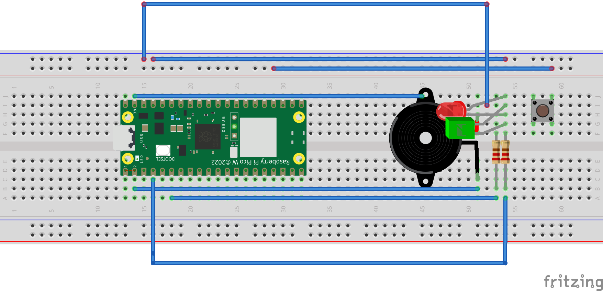

# 🔥 FANS (Fire Alarm Notification System)


FANS is a comprehensive multi-system solution for fire-related emergencies that require prompt notification of persons
in the affected area.

FANS utilizes smoke and temperature sensors to accurately detect fires in its surrounding environment. Upon detection,
FANS issues SMS and email notifications to individuals in the surrounding area.

FANS provides a dashboard for live monitoring of its environment, as well as an interface for customizing things like
its sensitivity to pressure changes.

## Table Of Contents
- [Contributors](#contributors)  
- [Repository Organization](#repository-organization)
- [Installation and Setup Guide](#installation-and-setup-guide) 
   - [Sensor Pi](#sensor-pi)
   - [Alarm System](#alarm-system)
   - [Notifier](#notifier)
   - [Pico Alarm](#pico-alarm)
   - [Web App](#web-app)

## Contributors

SYSC3010 group L1-G8, under guidance of TA Sean Kirkby.

- Grant Achuzia
- Javeria Sohail
- Matteo Golin
- Saja Fawagreh

## Repository Organization

FANS is composed of several different nodes. Within the project repository, each node is given its own directory
containing its required files.

- The data collection system is stored in [`sensor-pi/`][sensor-pi]
- The notification system is stored in [`notifier/`][notifier]
- The web GUI is stored in [`web-app/`][gui]
- The alarm system is stored in [`alarm-system/`][alarm]
- The haptic alarm system is stored in [`pico_alarm/`][haptic]

In addition, the `docs/` directory contains documentation on our system design. Within `docs/`, the `assets/` folder
contains all of the UML class, sequence, state machine and deployment diagrams which describe the FANS system and which
are used throughout our reports. The `design-report/` folder contains all of the LaTeX source files that compose the
FANS design report, and the `proposal/` folder contains the LaTeX source files for building our initial project proposal.

## Installation and Setup Guide

Guides to install and run each system node are provided below. Once all nodes have been set up, the system will be
functional.

### Installation Table Of Contents
- [Sensor Pi](#sensor-pi)
- [Alarm System](#alarm-system)
- [Notifier](#notifier)
- [Pico Alarm](#pico-alarm)
- [Web App](#web-app)

### Sensor-Pi

In order to set up the `sensor-pi` sensor data collection system, you will need:

- Raspberry Pi 4
- Sense hat
- Breadboard
- Wires
- 2x 10k resistors
- 2x 1k resistors
- 2x NPN bipolar-junction transistors
- Flying fish MQ2 smoke detector module

In order to assemble the circuit, place the components on your breadboard according to the following schematic. Power
sources can come from the Raspberry Pi or an external source. The labelled pin outputs (GPIO 22, SCLK, MOSI, MISO) are
all meant to be connected to the corresponding pin on the Raspberry Pi 4. Please see its [pinout][pi-pinout] sheet to
locate this pins.


Ensure that the following files are present in the same directory for it to function properly:

- `firebase_config.json`: This file should include the configuration details required to connect to the Firebase
  database, such as the API key, authentication domain, database URL, and storage bucket.

Example `firebase_config.json` file:

```json
{
  "apiKey": "yourKey",
  "authDomain": "yourDomain",
  "databaseURL": "https://your-database-url",
  "storageBucket": "someStorageBucket"
}
```

Once the circuit is built and connected, the node can be started by running the software located in the `sensor-pi`
directory from the Raspberry Pi. Python 3.11 must be previously installed. The following commands will download the
repository and start the software when run in the terminal:

```console
git clone https://github.com/SYSC3010-W24/sysc3010-project-l1-g8.git
cd sysc-project-l1-g8/sensor-pi
python3 -m venv venv
source venv/bin/activate
pip install -r requirements.txt
python3 main.py
```

### Alarm System

In order to set up the `alarm-system` node, you will need:

- Raspberry Pi 4
- Breadboard
- Wires
- Passive piezoelectric buzzer
- Red LED
- 1k resistor

In order to assemble the circuit, place the components on your breadboard according to the following schematic. The 3.3V
input signal should be connected to the Raspberry Pi's GPIO 22 pin. Please see the Pi's [pinout][pi-pinout] sheet to
connect the pins properly.


Once the circuit is assembled and connected, the node can be started by running the software located in the
`alarm-system` directory from the Raspberry Pi. Python 3.11 must be previously installed. The following commands will
download the repository and start the software when run in the terminal:

```console
git clone https://github.com/SYSC3010-W24/sysc3010-project-l1-g8.git
cd sysc-project-l1-g8/alarm-system
python3 -m venv venv
source venv/bin/activate
pip install -r requirements.txt
python3 main.py
```

### Notifier

In order to set up the `notifier` node, you will need:

- Raspberry Pi 4

The node can be started by running the software located in the notifier directory on the Raspberry Pi. Prior installation of Python 3.11 is required. Execute the following commands in the terminal to download the repository and start the software:

```console
git clone https://github.com/SYSC3010-W24/sysc3010-project-l1-g8.git
cd sysc-project-l1-g8/notifier
python3 -m venv venv
source venv/bin/activate
pip install -r requirements.txt
python3 email_notification_system.py
```

Additionally, ensure that the following files are present in the same directory for it to function properly:

- `fans_credentials.json`: This file should contain the username and password required for authentication to the email server, enabling the system to send notifications via email.
- `firebase_config.json`: This file should include the configuration details required to connect to the Firebase database, such as the API key, authentication domain, database URL, and storage bucket.
- `twilio_credentials.json`: This file should contain the authentication credentials for accessing the Twilio API, including the account SID and authentication token, enabling the system to send notifications via SMS.

### Pico-Alarm

In order to set up the `pico_alarm` buzzer alarm and led notifier system, you will need:

- Raspberry Pi Pico W
- Piezoelectric Buzzer
- 1 red and 1 green LED
- Breadboard
- Wires
- 2x 10k resistors

**Hardware Assembly**



1. **Connect the Buzzer** to GPIO 1 on the Pico W.
2. **Attach the Red LED** to GPIO 6 with a 10k resistor in series.
3. **Attach the Green LED** to GPIO 5 with a 10k resistor in series.
4. **Set up the Button** on GPIO 18, ensuring it's properly debounced with a 10k resistor.
5. **Wire everything** according to the schematic on a breadboard, ensuring secure connections.

**Software Installation and Deployment for Pico_Alarm System**

1. **Connect the Raspberry Pi Pico W** to your computer. Use a USB cable to establish the connection. Ensure the Pico is in MicroPython mode.
2. **Open Thonny IDE** on your computer. It's recommended to use Thonny for working with MicroPython on Raspberry Pi Pico due to its built-in support.
3. **Prepare the Python Script**: Have the `pico_alarm.py` script ready. This script includes the logic for monitoring the Firebase database and activating the buzzer and LEDs.
4. **Configure the Script**:
   - **WiFi Credentials**: Within the script, locate the `do_connect()` function. Replace `"your_wifi_ssid"` and `"your_wifi_password"` with your actual WiFi network SSID and password.
   - **Firebase URL**: Find the `firebase_url` variable in the script. Change its value to your Firebase database URL where the emergency flag will be checked.
5. **Deploy the Script to Pico W**:
   - In Thonny, select MicroPython (Raspberry Pi Pico) as the interpreter from the bottom right corner.
   - Open the `pico_alarm.py` script in Thonny.
   - Click on 'File' > 'Save As...' and choose to save the script on your Raspberry Pi Pico.
6. **Run the Script**:
   - With the `pico_alarm.py` script open in Thonny, press the green 'Run' button to execute the script on the Pico W.
   - The script will automatically start monitoring the Firebase database for any emergency flags and activate the buzzer and LEDs accordingly.

**Note**: The Raspberry Pi Pico W must be powered continuously for the alarm system to function. It can remain powered via the USB connection to your computer or through an external 5V power source.

**Operational Notes**

- The system checks the Firebase database at regular intervals for any emergency flags.
- The buzzer and red LED activate to indicate an emergency, with the green LED indicating normal operations.
- The button serves as an acknowledgment mechanism to stop the alarm and reset the system to its normal state.

[wiki]: https://github.com/SYSC3010-W24/sysc3010-project-l1-g8/wiki
[alarm]: https://github.com/SYSC3010-W24/sysc3010-project-l1-g8/tree/main/alarm-system
[sensor-pi]: https://github.com/SYSC3010-W24/sysc3010-project-l1-g8/tree/main/sensor-pi
[gui]: https://github.com/SYSC3010-W24/sysc3010-project-l1-g8/tree/main/web-app
[haptic]: https://github.com/SYSC3010-W24/sysc3010-project-l1-g8/tree/main/pico_alarm
[notifier]: https://github.com/SYSC3010-W24/sysc3010-project-l1-g8/tree/main/notifier
[pi-pinout]: https://www.the-diy-life.com/wp-content/uploads/2021/05/Raspberry-Pi-4-Pinout.png

### Web App

In order to set up the `web-app` node, you will need: 

- Raspberry Pi 4
- Access to the internet

FANS web application is made using Flask, an easy to use Python micro framework. Execute the following commands in the terminal to download the repository and start the software:

```console
git clone https://github.com/SYSC3010-W24/sysc3010-project-l1-g8.git
cd sysc-project-l1-g8/web-app
python3 -m venv venv
source venv/bin/activate
pip install -r requirements.txt
python3 main.py
```

In the terminal, click on the second http link to access the web app on your browser:  
`Running on http://your.ip.address`

